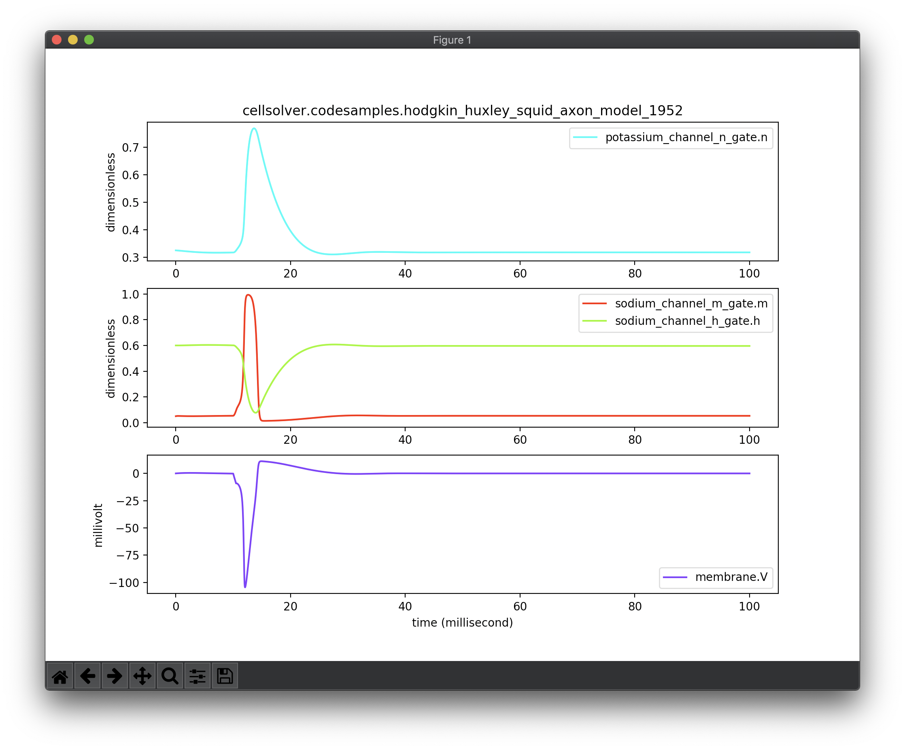

Cell Solver
===========

A basic codebase for investigating the code generation output from libCellML.

Install
-------

Use 'pip' to install from the repository::

 pip install git+https://github.com/hsorby/cellsolver.git@master

This will install the latest version available on the 'master' branch.

Run
---

The installation will add a command line tool for running 'cellsolver'.  To run the application type::

 cellsolver

on the command line to execute the default solution which is the Hodgkin Huxley squid axon 1952 model solved using the
(forward) Euler method.

The application will show the solution of the Hodgkin Huxley model as a plot of the four state variables.

Usage
-----

Here are the usage instructions for the 'cellsolver' application::

 usage: cellsolver [-h] [--solver] [--timeit [TIMEIT]]
                   [--interval INTERVAL INTERVAL] [--step-size STEP_SIZE]
                   [module]

 Solve ODE's described by libCellML generated Python output.

 positional arguments:
   module                a module of Python code generated by libCellML

 optional arguments:
   -h, --help            show this help message and exit
   --solver SOLVER       specify the solver: ['euler', 'dop853', 'vode']
                         (default: euler)
   --timeit [TIMEIT]     number of iterations for evaluating execution elapsed
                         time (default: 0)
   --interval INTERVAL INTERVAL
                         interval to run the simulation for (default: [0.0,
                         100.0])
   --step-size STEP_SIZE
                         the step size to output results at (default: 0.001)

There are three solvers currently available: euler, vode, dop853.  To run the application with a particular solver
add one of the known solvers to the command line, for example::

 cellsolver --solver vode

will run the application using the 'vode' solver from scipy.

There is also functionality to time the execution of the solver.  To make use of this add the command line parameter
'--timeit' to the command.  Using this form of the command will run the solver 10 times and print out the average time
to execute the full simulation.  For example to time the 'dop853' solver use the following command::

 cellsolver --timeit --solver dop853

Be aware that this may take some time to finish executing.  It is also possible to set the number of iterations to
perform in the timed loop by adding an integer parameter to the '--timeit' argument, for example::

 cellsolver --timeit 67 --solver dop853

Will time the simulation for 67 runs and report on the average elapsed time for each run.

The optional positional module argument can be a file path.  This file path must be a module of Python code
generated from libCellML.

.. warning::
  'cellsolver' now relies on code generated from the codebase available `here <https://github.com:hsorby/libcellml@master>`_

Additional
----------

It is highly recommended to use a virtual environment to install 'cellsolver' into.
